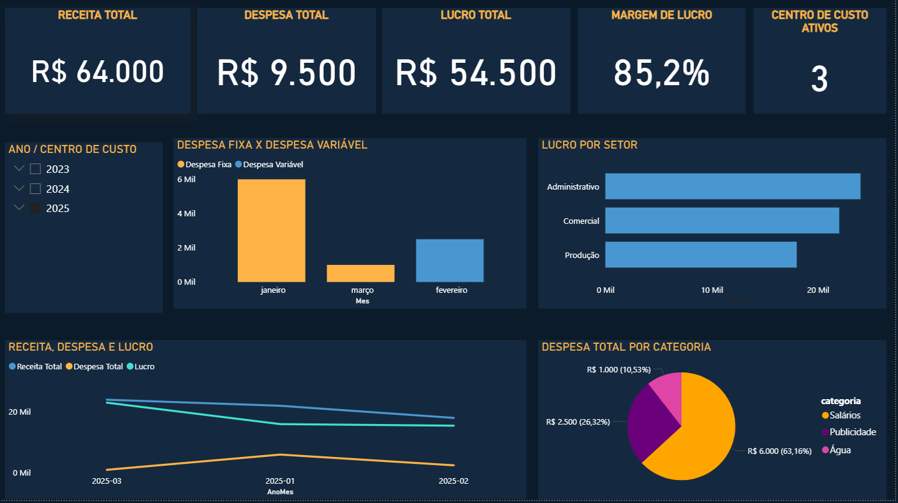

# 📊 Dashboard Financeiro em Power BI

Projeto de visualização financeira desenvolvido no Power BI com base em dados SQL Server. O objetivo é acompanhar receitas, despesas, lucros e centros de custo da empresa de forma interativa e visual.

---

## 🧩 Funcionalidades

- Visualização de **Receitas e Despesas por Mês**
- Cálculo automático de **Lucro e Margem de Lucro (%)**
- Análise por **Centro de Custo** (Administrativo, Comercial, Produção)
- Filtros por **Ano, Mês e Departamento**
- Segmentação de **Despesas Fixas e Variáveis**

---

## 🛠 Tecnologias Utilizadas

- **Power BI**
- **SQL Server** (T-SQL)
- Modelagem de dados em estrela (fato + dimensões)
- DAX para métricas personalizadas

---

## 📸 Captura de Tela

> Visual do dashboard final com indicadores, gráficos e segmentações interativas.

---

## 🗃 Estrutura do Projeto

